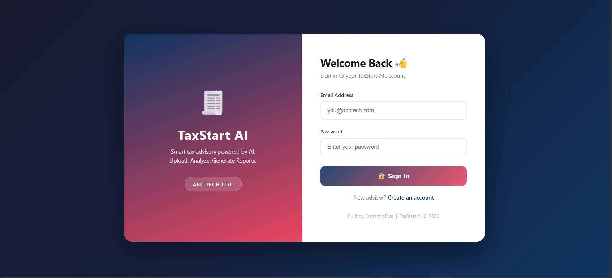
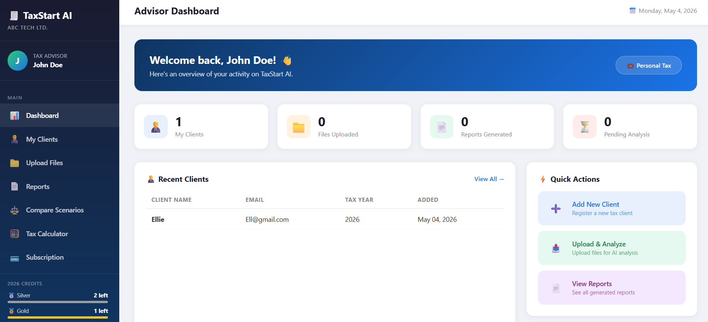
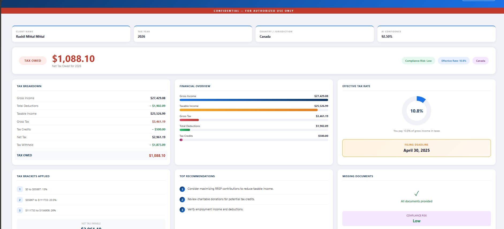
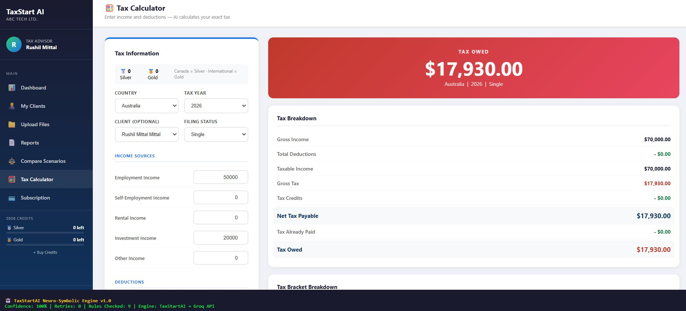
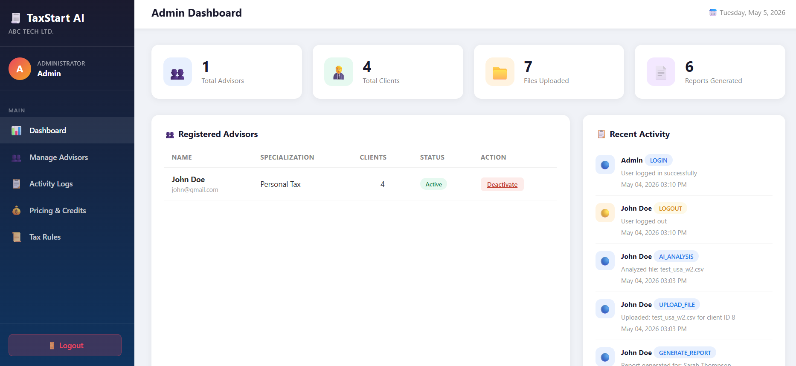

# TaxStart AI

Tax analysis platform where advisors upload client documents and an AI reads them, calculates taxes, and generates reports. The catch — I don't just throw everything at an LLM and hope for the best. There's a full symbolic rules engine sitting between the user and the API that validates every number the AI returns, rejects garbage, and retries with correction hints until the math checks out.

Built with PHP, MySQL, and Groq's LLM API.


## Screenshots

**Login**


**Advisor Dashboard** — metrics, recent clients, quick actions


**AI-Generated Tax Report** — breakdown, brackets, recommendations, compliance risk, confidence score


**Tax Calculator** — input income/deductions, get validated results with neuro-symbolic engine status bar at the bottom


**Admin Dashboard** — platform-wide metrics, advisor management, activity audit log


---

## How the AI Actually Works

Most AI wrappers just send a prompt and display whatever comes back. That's fine for chatbots, not for tax math. LLMs hallucinate numbers constantly — they'll tell you your tax is $45,000 on a $40,000 income and sound confident doing it.

So I built a neuro-symbolic architecture. Two layers working together:

**Symbolic layer (mine)** — hardcoded tax brackets, validation rules, confidence scoring, retry logic. This is the brain that knows what a correct answer looks like.

**Neural layer (Groq API)** — Llama 3.3 70B for text analysis and calculations, Llama 4 Scout for reading uploaded images of T4 slips and pay stubs. This does the heavy lifting but is never trusted blindly.

Here's the actual flow:

```
User uploads document or enters tax info
          │
          ▼
   SYMBOLIC PRE-PROCESSING
   • Pre-calculates gross income, deductions, estimated taxable
   • Looks up known tax brackets for the country
   • Builds a structured command (not a casual prompt)
   • Injects admin-uploaded tax rules if they exist
          │
          ▼
   NEURAL LAYER (Groq API)
   • Llama 3.3 70B processes text / calculates
   • Llama 4 Scout Vision reads images (T4s, pay stubs)
   • Returns structured key:value pairs (enforced format)
          │
          ▼
   SYMBOLIC POST-PROCESSING
   • Runs 8 validation rules against the output
   • If a critical rule fails → retry (up to 3x)
     with the failure reason fed back as a correction hint
   • Applies forced corrections (STATUS, effective rate)
   • Cross-checks neural tax against symbolic bracket calculation
   • Scores confidence 0-100%
          │
          ▼
   User sees validated result + confidence score
```

### The 8 Validation Rules

Every calculation the AI returns goes through these before the user sees anything:

| # | Rule | Severity | What it catches |
|---|------|----------|-----------------|
| 1 | Gross income > 0 | Critical | Empty or zero responses |
| 2 | Tax ≤ income | Critical | AI saying you owe more than you made |
| 3 | Effective rate 0-70% | Critical | Absurd tax percentages |
| 4 | Taxable = gross - deductions (±5%) | Warning | Math that doesn't add up |
| 5 | Deductions ≤ income | Warning | Deductions exceeding total income |
| 6 | STATUS matches REFUND/OWED sign | Warning | Says "REFUND" when number is negative |
| 7 | Bracket rates 0-60% | Warning | Fake bracket percentages |
| 8 | Symbolic tax cross-check | Info | Independently calculates tax from hardcoded brackets, compares to AI result within 10% |

If a critical rule fails, the engine doesn't just flag it — it retries the entire API call with the failure reason injected: `"[RETRY 2 — CORRECTION REQUIRED: Gross tax (45000) cannot exceed gross income (40000)]"`. The AI gets a second (and third) chance to get it right.

### Symbolic Knowledge Base

This is hardcoded in `TaxStartAI.php`, not pulled from any API:

- **Tax brackets**: Canada (5 brackets, 15%→33%), USA (7 brackets, 10%→37%), UK (4 brackets, 0%→45%) — all 2024 rates with progressive calculation
- **Standard deductions**: Canada BPA ($15,705), USA single ($14,600) / married ($29,200), UK allowance (£12,570), Australia threshold ($18,200), India standard (₹75,000)
- **Filing deadlines**: 5 countries — injected into reports when the LLM forgets to mention them
- **Confidence scoring**: starts at 100, loses 20 per critical failure, 8 per warning, 5 per retry, gains 5 if symbolic cross-check passes

You can see the engine status in the bottom bar of the tax calculator screenshot — `Confidence: 100% | Retries: 0 | Rules Checked: 9 | Engine: TaxStartAI → Groq API`.

---

## Features

**For Advisors:**
- Upload tax documents (T4, pay stubs, CSV, PDF, DOCX, XLSX, images) and get AI analysis
- Vision AI reads uploaded images directly — no manual data entry
- Tax calculator with validated results and bracket breakdown
- Compare two tax scenarios side by side (winner determined symbolically)
- Generate downloadable HTML reports with charts and recommendations
- Client management with masked SIN storage (only last 3 digits kept)
- Credit system — Silver for Canadian tax, Gold for international

**For Admin:**
- Dashboard with platform-wide metrics
- Activate/deactivate advisor accounts
- Full activity audit log (every login, upload, analysis, payment tracked)
- Upload tax rule files (PDF/TXT/CSV) that get injected into AI context
- Configure subscription pricing for Silver and Gold tiers

---

## Tech Stack

| What | Tech |
|------|------|
| Core AI engine | PHP 8.2 — `TaxStartAI.php`, 730 lines of rules/validation/retry logic |
| LLM | Groq API — Llama 3.3 70B (text) + Llama 4 Scout (vision) |
| Backend | PHP 8.2 with PDO prepared statements |
| Database | MySQL / MariaDB 10.4 — 13 tables with foreign keys |
| Frontend | HTML5, CSS3, vanilla JS |
| Auth | bcrypt hashing, session-based with role checking |

---

## Database

13 tables. The important relationships:

```
users
  ├── advisor_profiles
  ├── advisor_credits
  ├── activity_logs (audit trail)
  ├── subscriptions
  ├── payments
  ├── clients (SIN masked)
  │     ├── uploaded_files → ai_analysis
  │     └── reports
  └── credit_usage

subscription_pricing (admin-configurable)
tax_rules (admin-uploaded files for AI context injection)
```

SIN numbers are masked before storage. Passwords are bcrypt hashed. Every action is logged with timestamp and IP.

---

## Setup

**You need:** XAMPP 8.2+, a free [Groq API key](https://console.groq.com)

1. Clone it
   ```bash
   git clone https://github.com/YOUR_USERNAME/taxstart-ai.git
   ```

2. Drop it in htdocs
   ```bash
   cp -r taxstart-ai/ C:/xampp/htdocs/taxstart
   ```

3. Create the database — open phpMyAdmin, run `CREATE DATABASE IF NOT EXISTS TAXSTART_db;`, then import `sql/taxstart_db.sql`

4. Set up db connection
   ```bash
   cp includes/db.example.php includes/db.php
   ```

5. Add your Groq API key — replace `YOUR_GROQ_API_KEY_HERE` in:
   - `includes/TaxStartAI.php` (line 16)
   - `ai/analyze.php` (line 246)
   - `advisor/reports.php` (line 28)

6. Make sure these folders exist: `assets/uploads/`, `assets/reports/`, `assets/tax_rules/`

7. Start Apache + MySQL in XAMPP, go to `http://localhost/taxstart/`

**Default admin login:** `admin@taxstart.local` / `admin@123`
New advisor accounts created through the signup page.

---

## Project Structure

```
taxstart/
├── ai/
│   └── analyze.php              # Document analysis (Vision + Text pipeline)
├── admin/
│   ├── dashboard.php            # Admin overview + metrics
│   ├── advisors.php             # Advisor management
│   ├── logs.php                 # Activity audit log
│   ├── pricing.php              # Subscription pricing
│   └── tax_rules.php            # Tax rule uploads
├── advisor/
│   ├── dashboard.php            # Advisor home
│   ├── clients.php              # Client management
│   ├── upload.php               # File upload → AI trigger
│   ├── reports.php              # Report generation
│   ├── compare.php              # Scenario comparison
│   ├── calculator.php           # Tax calculator
│   └── subscription.php         # Buy credits
├── includes/
│   ├── TaxStartAI.php           # Core neuro-symbolic engine
│   ├── auth.php                 # Auth + sessions
│   ├── credits_helper.php       # Credit system
│   ├── db.example.php           # DB connection template
│   ├── functions.php            # Utilities
│   └── tax_rules_helper.php     # Tax rule parser
├── assets/
│   ├── css/
│   ├── images/
│   ├── js/
│   ├── uploads/                 # User docs (gitignored)
│   ├── reports/                 # Generated reports (gitignored)
│   └── tax_rules/               # Admin rules (gitignored)
├── samples/
│   ├── Sample_T4_Canada_2024.pdf    # Canadian T4 (Silver tier test)
│   ├── Sample_W2_USA_2024.pdf       # US W-2 (Gold tier test)
│   ├── Sample_P60_UK_2024.pdf       # UK P60 (Gold tier test)
│   ├── Sample_Form16_India_2024.pdf  # India Form 16 (Gold tier test)
│   ├── test_canada_t4.csv           # CSV version for text extraction testing
│   ├── test_usa_w2.csv
│   ├── test_uk_p60.csv
│   └── test_india_form16.csv
├── screenshots/
├── sql/taxstart_db.sql
├── config.php
├── index.php
├── signup.php
└── logout.php
```

---

## What I'd Do Differently

- Move the API key to a single env variable instead of hardcoding it in 3 files
- Add bracket data for more countries so the symbolic cross-check covers more cases
- Swap the demo payment flow for Stripe
- Add PHPUnit tests for the symbolic engine — the validation rules are pure functions, easy to test
- Queue-based processing for high volume instead of synchronous API calls
- Better scanned PDF handling (right now the workaround is screenshotting and uploading as PNG)

---

## License

MIT License — free to use, modify, and distribute.
